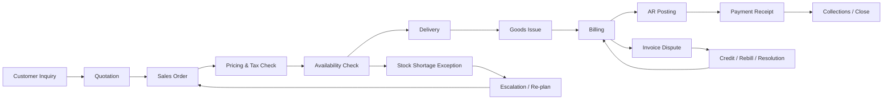

# Order-to-Cash (O2C) Process Flow

```mermaid
flowchart LR
A[Customer Inquiry] --> B[Quotation]
B --> C[Sales Order]
C --> D[Pricing & Tax Check]
D --> E[Availability Check]
E --> F[Delivery]
F --> G[Goods Issue]
G --> H[Billing]
H --> I[AR Posting]
I --> J[Payment Receipt]
J --> K[Collections / Close]

E --> L[Stock Shortage Exception]
L --> M[Escalation / Re-plan]
M --> C

H --> N[Invoice Dispute]
N --> O[Credit / Rebill / Resolution]
O --> H
```

This diagram can be pasted into Word or Markdown tools that support Mermaid rendering.
